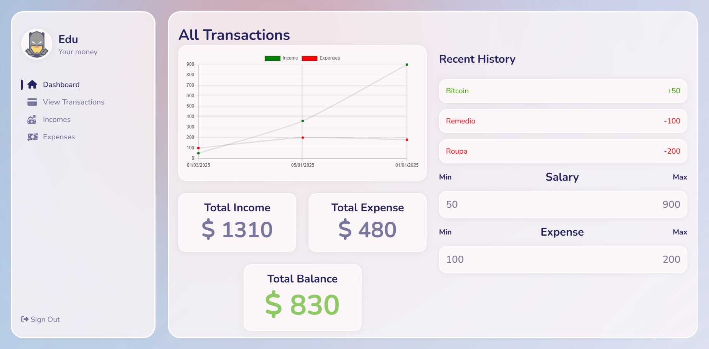

# Expenses-Tracker-Node
# Gerenciador Financeiro Pessoal 💰

[](https://nodejs.org/)
[](https://react.dev/)

Aplicação web para gerenciamento de entradas e saídas financeiras, com dashboard interativo para visualização do fluxo de caixa.

 <!-- Adicione uma imagem real posteriormente -->

## ✨ Funcionalidades

- Visualização resumida das finanças em dashboard
- Adição de novas transações (entradas e saídas)
- Exclusão de transações existentes
- Filtragem por tipo (entrada/saída) e data
- Cálculo automático do saldo total
- Interface responsiva e intuitiva

## 🛠 Tecnologias Utilizadas

**Frontend:**
- React
- JavaScript
- HTML5/CSS3

**Backend:**
- Node.js
- Express
- **MongoDB (banco de dados NoSQL)**
- **Mongoose (ODM para MongoDB)**
- API RESTful com endpoints:
  - GET `/get-incomes` - Lista todas as entradas
  - POST `/add-income` - Cria nova entrada
  - DELETE `/delete-income/:id` - Remove entrada
 
  - GET `/get-expenses` - Lista todas as saidas
  - POST `/add-expense` - Cria nova saida
  - DELETE `/delete-expense/:id` - Remove saida

## 🚀 Instalação

1. Clone o repositório
```bash
git clone https://github.com/Cabr1to/Expenses-Tracker-Node.git
```
2. Instale as dependências (backend e frontend)
```bash
cd backend
npm install

cd ../frontend
npm install
```

3. Configure as variáveis de ambiente (crie um arquivo .env no backend com):
```bash
MONGODB_URI=sua_string_de_conexao_mongodb
PORT=3001
```
4. Inicie os servidores
# Backend (Node.js)
```bash
cd backend
npm start
```
# Frontend (React)
```bash
cd ../frontend
npm run dev
```


## 🤝 Contribuição
- Contribuições são bem-vindas! Siga estes passos:

1. Faça um Fork do projeto

2. Crie uma Branch (git checkout -b feature/nova-feature)

3. Commit suas mudanças (git commit -m 'Adiciona nova feature')

4. Push para a Branch (git push origin feature/nova-feature)

5. Abra um Pull Request


Desenvolvido com ❤️ por [Cabr1to] - ✉️ [luis.b.c.melo@gmail.com]
